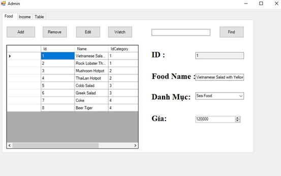

 <h1 align="center">Restaurant management</h1>

## Introduction

A restaurant system, whether large or small, must have a central management system. The main divisions include: Account, bill, billinfo, food, foodCategory and TableFood. Those components are called entities. They interact with each other to create a restaurant management system.
The main tasks of the entities are as follows:
- Account includes many employees with different positions. But here we only consider admin and staff as the two main positions.
- Bill is the food bill ordered for each table to pay
- Billinfo contains the Bill related id number of each table to record the items called by each Bill for easy payment.
- Food includes dishes and drinks.
-TableFood is used to control the number of tables and operating status in the restaurant.
- FoodCategory is a warehouse used to classify food.

## Database description
a.	Food category
-Information on classification of food groups such as Sea Food, Hot Pot ….

b.	Food
-Information of dishes is stored such as name, price and classification in stock

c.	Billinfo
-Information includes the id number of each bill, the id number of each item to be able to provide accurate information for 1 Bill for payment.

d.	Bill
-The bill entity includes the start and end dates of a table, and the number of tables. There is also the status of paid or not to change the status of the table to in use or empty.

e.	TableFood
-The TableFood entity consists of the table name and the state of the table.

f.	Account
-The Account entity will store the user's information, position, working status.

   

## System_design

   
  

## Interface_design
-Login interface-

   
  

-Table management,food ordering-

   
  

-Settings account-

   
  

-Account adding-

   
  

-Employee management-

   
  

-Working shifts management-

   
  

-Food adding and deleting-

   
  

-Income management-

   
  

-Table adding and deleting-

   

## Notes 
C#
